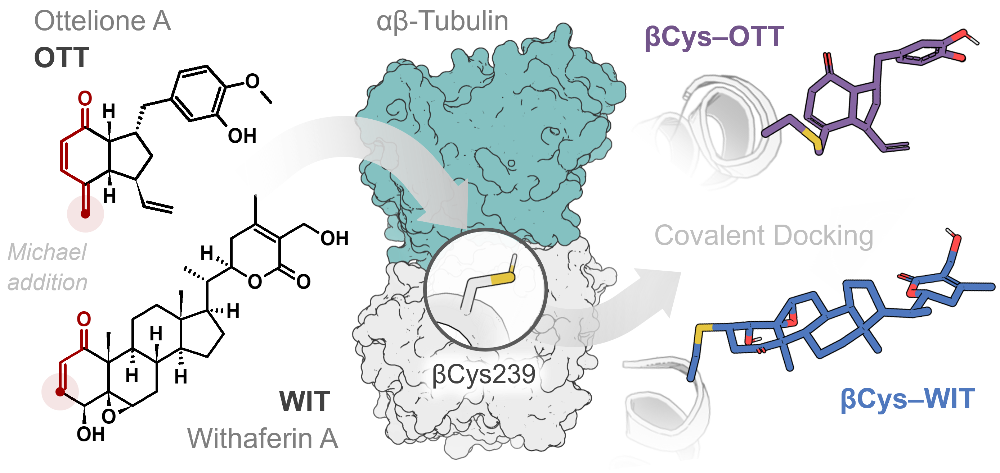

# Covalent Binding of OTT and WIT to β-Tubulin
This repository contains data and files from the manuscript:

**Carreón-Escalante, M.; Mar-Antonio, E.; Sánchez-Maza, S.; et al. (2026).**
*Elucidating the Covalent Binding of Ottelione A and Withaferin A at the Colchicine Site of β-Tubulin*.
*ACS Omega. In Press*.
DOI: [10.1021/acsomega.6c05137](https://doi.org/10.1021/acsomega.6c05137)

  

## 01_Docking
Most favorable binding poses obtained from the ensemble covalent docking study.

## 02_MD
Modified files of the Amber14SB force field designed to recognize covalent adducts with withaferin A (WIT) and ottelione A (OTT). It also includes Coordinate and topology files used for molecular dynamics (MD) simulations.
